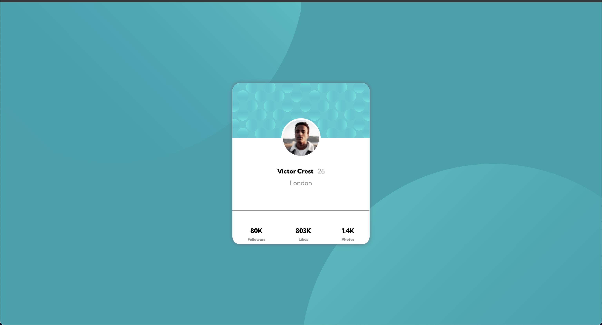
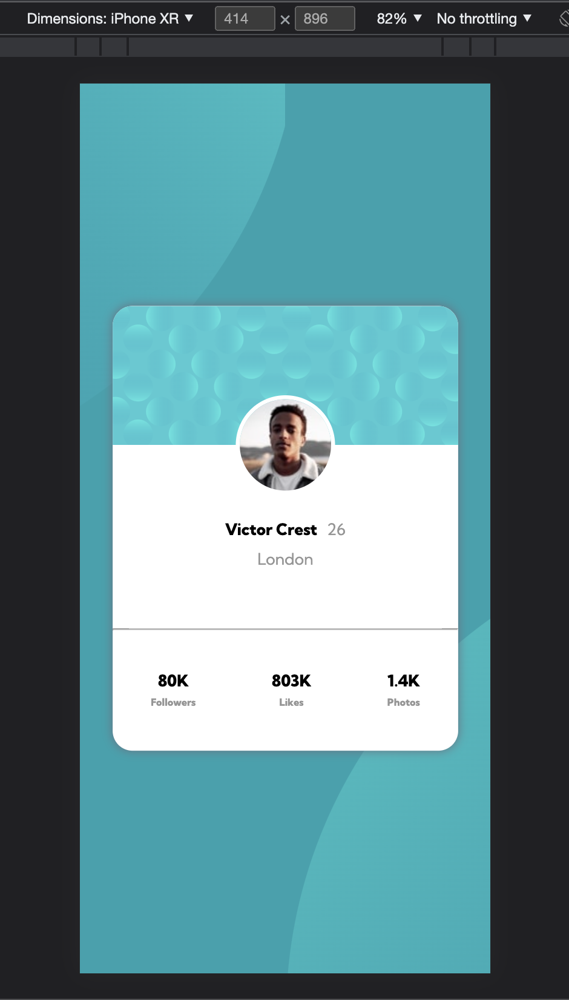

# Frontend Mentor - Profile card component solution

This is a solution to the [Profile card component challenge on Frontend Mentor](https://www.frontendmentor.io/challenges/profile-card-component-cfArpWshJ). Frontend Mentor challenges help you improve your coding skills by building realistic projects. 

## Table of contents

- [Overview](#overview)
  - [The challenge](#the-challenge)
  - [Screenshot](#screenshot)
  - [Links](#links)
- [My process](#my-process)
  - [Built with](#built-with)
  - [What I learned](#what-i-learned)
  - [Continued development](#continued-development)
  - [Useful resources](#useful-resources)
- [Author](#author)
- [Acknowledgments](#acknowledgments)

**Note: Delete this note and update the table of contents based on what sections you keep.**

## Overview

### The challenge

- Build out the project to the designs provided

### Screenshot

### Links

- Solution URL: [Add solution URL here](https://github.com/venkatvamshi/venkatvamshi.github.io)
- Live Site URL: [Add live site URL here](https://venkatvamshi.github.io/)

## My process

### Built with

- Semantic HTML5 markup
- CSS custom properties
- Flexbox
- Media queries for mobile view

### What I learned

Learnt how to use flexbox, actually this challenge gave a good amount of confidence to me as i did this completly on my own without copying css styles. I used to just copy styles before, but now i started to understand the reason behind having those properties, especially with the positioning.

### Continued development
I want to improve on flexbox and responsive designs, mainly with positioning the elements, i felt difficult while setting the background images in the correct position. Even now i feel that they are not correct. I am not sure where exactly to use `transform` property. 

Further learnings : positioning `absolute vs relative`, when to use `transform : translate()` property. 

### Useful resources.

Youtube vidoes from kevin powell and coder coder helped me in organising css.

## Author

- Website - [vamshi dondapati](https://github.com/venkatvamshi/venkatvamshi.github.io)
- Frontend Mentor - [@venkatvamshi](https://www.frontendmentor.io/profile/venkatvamshi)
- LinkedIn - [@vamshi-dondapati-a1b891a3](https://www.linkedin.com/in/vamshi-dondapati-a1b891a3)

## Acknowledgments

Thanks to @kevin powell and @coder coder from youtube. I became 1 from 0 in html and css.
